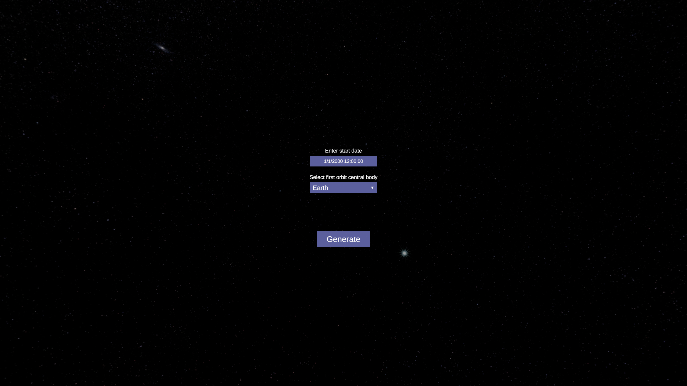

# orbital-mechanics-simulation
An orbital mechanics simulation/visualisation made with Unity.
This project aims to provide a simple implementation of a basic space maneuver system (with autopilot) and show how much time space travel takes in the Solar System. All data is as close to the real values as possible.

### How to use
1. Create a spacecraft on an orbit around given celestial body at a specific time.

2. Create maneuvers pressing on spacecraft's orbit/tracjectory.

3. Modify maneuvers by pressing arrows that represent change to velocity in the marked direction

4. You can also drag the entire maneuver node along the trajectory line

5. Use autopilot or rotate the spacecraft towards the final maneuver direction marked as an arrow near the spacecraft

6. Wait for autopilot to make the burn or do it yourself when spacecraft is near the maneuver node

7. You can also create multiple maneuver nodes that relay on future trajectories

### Controls
- `Q` - unlock cursor (press in empty space to lock cursor)
- `W` `A` `S` `D` - rotate spacecraft
- `Space` - add acceleration